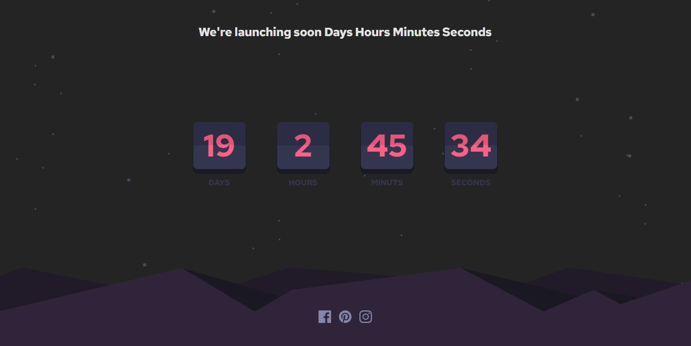

# Frontend Mentor - Launch countdown timer solution

This is a solution to the [Launch countdown timer challenge on Frontend Mentor](https://www.frontendmentor.io/challenges/launch-countdown-timer-N0XkGfyz-). Frontend Mentor challenges help you improve your coding skills by building realistic projects.

## Launh countdown

## Overview

### The challenge

Users should be able to:

- See hover states for all interactive elements on the page
- See a live countdown timer that ticks down every second
- **Bonus**: When a number changes, make the card flip from the middle

### Screenshot



## My process

### Built with

- Semantic HTML5 markup
- CSS custom properties
- Flexbox
- React + TypeScript + Vite

### Praticed

```css
span {
  background-image: linear-gradient(
    to bottom,
    #e2567a 0%,
    #e2567a 50%,
    #fb6087 50%,
    #fb6087 100%
  );
  -webkit-background-clip: text;
  background-clip: text;
  -webkit-text-fill-color: transparent;
}
```

```js
const [time, setTime] = useState(date);

setInterval(updateTime, 1000);

function updateTime() {
  const newTime = new Date().getTime();
  setTime(newTime);
}
```
